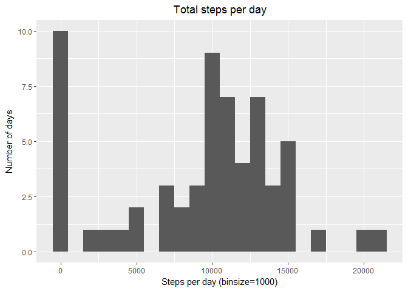
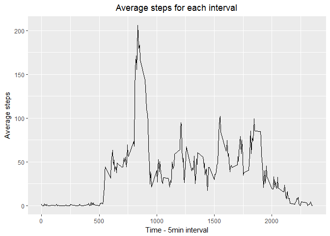
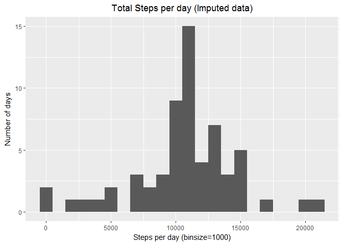
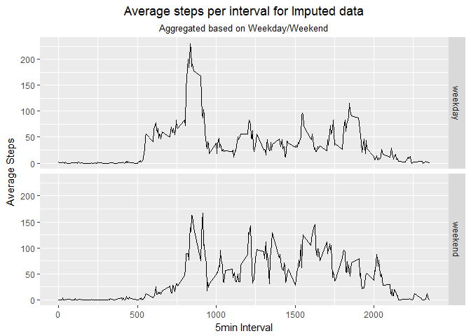

# Reproducible Research - Project 1
Amir Azmi  
April 6, 2017  


 
----  

This project explores the data from a personal activity monitoring device (such as Fitbit, Nike's Fuelband or Jawbone Up) collected at 5 minutes interval.  

The data is made available from: <https://d396qusza40orc.cloudfront.net/repdata%2Fdata%2Factivity.zip>  

The variables included in this dataset are:  
    1. **steps**: Number of steps taking in a 5-minute interval (missing values are coded as NA)  
    2. **date**: The date on which the measurement was taken in YYYY-MM-DD format  
    3. **interval**: Identifier for the 5-minute interval in which measurement was taken  
  

----
  
First we load the data.   


```r
#check directory and create
setwd("F:/Coursera/05 Reproducible Research/Project/Wk 2/Final")
if ( !file.exists( "data" )) {
    dir.create ( "data" )
}

downloadDate <- gsub(":",".",date())

targ_url <- "https://d396qusza40orc.cloudfront.net/repdata%2Fdata%2Factivity.zip"
destfile <- paste0("./data/activity data",downloadDate,".zip" )
download.file(targ_url, destfile=destfile, method="curl")

fname <- unzip(destfile, list=TRUE)$Name
unzip(destfile, files=fname, exdir="./data", overwrite=TRUE)
fpath <- file.path("./data", fname)

df <- read.csv(fpath)
```
<br>  
Data was downloaded on Thu Apr 06 15.52.47 2017.  
<br> 
Next, inspect the data and determine the first date to be 2012-10-01 and last date to be 2012-11-30.  
<br><br>
  
----  
  
### **Q1. What is mean total number of steps taken per day?**

For this part of the assignment, the missing values in the dataset have been ignored.
<br>
**1. Calculate the total number of steps taken per day**


```r
stepsperday <- data.frame(Steps=(tapply(df$steps, df$date, sum, na.rm=T)))
print(xtable::xtable(stepsperday,caption=""),type="html",html.table.attributes="width=250")
```

<!-- html table generated in R 3.3.2 by xtable 1.8-2 package -->
<!-- Sat Apr 08 15:18:45 2017 -->
<table width=250>
<caption align="bottom">  </caption>
<tr> <th>  </th> <th> Steps </th>  </tr>
  <tr> <td align="right"> 2012-10-01 </td> <td align="right">   0 </td> </tr>
  <tr> <td align="right"> 2012-10-02 </td> <td align="right"> 126 </td> </tr>
  <tr> <td align="right"> 2012-10-03 </td> <td align="right"> 11352 </td> </tr>
  <tr> <td align="right"> 2012-10-04 </td> <td align="right"> 12116 </td> </tr>
  <tr> <td align="right"> 2012-10-05 </td> <td align="right"> 13294 </td> </tr>
  <tr> <td align="right"> 2012-10-06 </td> <td align="right"> 15420 </td> </tr>
  <tr> <td align="right"> 2012-10-07 </td> <td align="right"> 11015 </td> </tr>
  <tr> <td align="right"> 2012-10-08 </td> <td align="right">   0 </td> </tr>
  <tr> <td align="right"> 2012-10-09 </td> <td align="right"> 12811 </td> </tr>
  <tr> <td align="right"> 2012-10-10 </td> <td align="right"> 9900 </td> </tr>
  <tr> <td align="right"> 2012-10-11 </td> <td align="right"> 10304 </td> </tr>
  <tr> <td align="right"> 2012-10-12 </td> <td align="right"> 17382 </td> </tr>
  <tr> <td align="right"> 2012-10-13 </td> <td align="right"> 12426 </td> </tr>
  <tr> <td align="right"> 2012-10-14 </td> <td align="right"> 15098 </td> </tr>
  <tr> <td align="right"> 2012-10-15 </td> <td align="right"> 10139 </td> </tr>
  <tr> <td align="right"> 2012-10-16 </td> <td align="right"> 15084 </td> </tr>
  <tr> <td align="right"> 2012-10-17 </td> <td align="right"> 13452 </td> </tr>
  <tr> <td align="right"> 2012-10-18 </td> <td align="right"> 10056 </td> </tr>
  <tr> <td align="right"> 2012-10-19 </td> <td align="right"> 11829 </td> </tr>
  <tr> <td align="right"> 2012-10-20 </td> <td align="right"> 10395 </td> </tr>
  <tr> <td align="right"> 2012-10-21 </td> <td align="right"> 8821 </td> </tr>
  <tr> <td align="right"> 2012-10-22 </td> <td align="right"> 13460 </td> </tr>
  <tr> <td align="right"> 2012-10-23 </td> <td align="right"> 8918 </td> </tr>
  <tr> <td align="right"> 2012-10-24 </td> <td align="right"> 8355 </td> </tr>
  <tr> <td align="right"> 2012-10-25 </td> <td align="right"> 2492 </td> </tr>
  <tr> <td align="right"> 2012-10-26 </td> <td align="right"> 6778 </td> </tr>
  <tr> <td align="right"> 2012-10-27 </td> <td align="right"> 10119 </td> </tr>
  <tr> <td align="right"> 2012-10-28 </td> <td align="right"> 11458 </td> </tr>
  <tr> <td align="right"> 2012-10-29 </td> <td align="right"> 5018 </td> </tr>
  <tr> <td align="right"> 2012-10-30 </td> <td align="right"> 9819 </td> </tr>
  <tr> <td align="right"> 2012-10-31 </td> <td align="right"> 15414 </td> </tr>
  <tr> <td align="right"> 2012-11-01 </td> <td align="right">   0 </td> </tr>
  <tr> <td align="right"> 2012-11-02 </td> <td align="right"> 10600 </td> </tr>
  <tr> <td align="right"> 2012-11-03 </td> <td align="right"> 10571 </td> </tr>
  <tr> <td align="right"> 2012-11-04 </td> <td align="right">   0 </td> </tr>
  <tr> <td align="right"> 2012-11-05 </td> <td align="right"> 10439 </td> </tr>
  <tr> <td align="right"> 2012-11-06 </td> <td align="right"> 8334 </td> </tr>
  <tr> <td align="right"> 2012-11-07 </td> <td align="right"> 12883 </td> </tr>
  <tr> <td align="right"> 2012-11-08 </td> <td align="right"> 3219 </td> </tr>
  <tr> <td align="right"> 2012-11-09 </td> <td align="right">   0 </td> </tr>
  <tr> <td align="right"> 2012-11-10 </td> <td align="right">   0 </td> </tr>
  <tr> <td align="right"> 2012-11-11 </td> <td align="right"> 12608 </td> </tr>
  <tr> <td align="right"> 2012-11-12 </td> <td align="right"> 10765 </td> </tr>
  <tr> <td align="right"> 2012-11-13 </td> <td align="right"> 7336 </td> </tr>
  <tr> <td align="right"> 2012-11-14 </td> <td align="right">   0 </td> </tr>
  <tr> <td align="right"> 2012-11-15 </td> <td align="right">  41 </td> </tr>
  <tr> <td align="right"> 2012-11-16 </td> <td align="right"> 5441 </td> </tr>
  <tr> <td align="right"> 2012-11-17 </td> <td align="right"> 14339 </td> </tr>
  <tr> <td align="right"> 2012-11-18 </td> <td align="right"> 15110 </td> </tr>
  <tr> <td align="right"> 2012-11-19 </td> <td align="right"> 8841 </td> </tr>
  <tr> <td align="right"> 2012-11-20 </td> <td align="right"> 4472 </td> </tr>
  <tr> <td align="right"> 2012-11-21 </td> <td align="right"> 12787 </td> </tr>
  <tr> <td align="right"> 2012-11-22 </td> <td align="right"> 20427 </td> </tr>
  <tr> <td align="right"> 2012-11-23 </td> <td align="right"> 21194 </td> </tr>
  <tr> <td align="right"> 2012-11-24 </td> <td align="right"> 14478 </td> </tr>
  <tr> <td align="right"> 2012-11-25 </td> <td align="right"> 11834 </td> </tr>
  <tr> <td align="right"> 2012-11-26 </td> <td align="right"> 11162 </td> </tr>
  <tr> <td align="right"> 2012-11-27 </td> <td align="right"> 13646 </td> </tr>
  <tr> <td align="right"> 2012-11-28 </td> <td align="right"> 10183 </td> </tr>
  <tr> <td align="right"> 2012-11-29 </td> <td align="right"> 7047 </td> </tr>
  <tr> <td align="right"> 2012-11-30 </td> <td align="right">   0 </td> </tr>
   </table>
Note that for days with zero steps, results may have been due to NA's.  
  
<br>
<br>


**2. Make a histogram of the total number of steps taken each day**

```r
qplot(stepsperday, xlab="Steps per day (binsize=1000)", ylab="Number of days", binwidth=1000, main="Total steps per day")+
    theme(plot.title = element_text(hjust=0.5))
```

<!-- -->
<br><br><br>

**3. Calculate and report the mean and median of the total number of steps taken per day**


```r
mean(stepsperday$Steps)
```

```
## [1] 9354.23
```

```r
median(stepsperday$Steps)
```

```
## [1] 10395
```
<br><br>


  
----  
  
### **Q2. What is the average daily activity pattern?**

**1. Make a time series plot (i.e. type = "l") of the 5-minute interval (x-axis) and the average number of steps taken, averaged across all days (y-axis)**


```r
stepsinterval <- aggregate(x=list(steps=df$steps), by=list(interval=df$interval), mean, na.rm=TRUE)

ggplot(data=stepsinterval, aes(x=interval, y=steps))+
    geom_line()+
    xlab("Time - 5min interval")+
    ylab("Average steps")+
    ggtitle("Average steps for each interval")+
    theme(plot.title = element_text(hjust=0.5))
```

<!-- -->
<br><br>

**2. Which 5-minute interval, on average across all the days in the dataset, contains the maximum number of steps?**
  

```r
stepsinterval[which.max(stepsinterval$steps),]
```

```
##     interval    steps
## 104      835 206.1698
```
On average, the maximum number of steps occurs at 8:35am.
<br><br>
  
  
----  
  
### **Q3. Imputing missing values**

There are a number of days/intervals where there are missing values (coded as NA). The presence of missing days may introduce bias into some calculations or summaries of the data.  
  


**1. Calculate and report the total number of missing values in the dataset (i.e. the total number of rows with NAs)**

```r
colSums(is.na(df))
```

```
##    steps     date interval 
##     2304        0        0
```
<br>

**2. Devise a strategy for filling in all of the missing values in the dataset. The strategy does not need to be sophisticated. For example, you could use the mean/median for that day, or the mean for that 5-minute interval, etc.**

    For this project, we will use the suggested method of taking the mean for the 5min interval. Essentially replacing the NA's using a lookup table from the average steps per interval data frame.


```r
aveimpute <- function(steps,interval){
    if(is.na(steps))
        steps <-stepsinterval[stepsinterval$interval==interval,"steps"]
    return(steps)
}
```
<br>

**3. Create a new dataset that is equal to the original dataset but with the missing data filled in.**
 
    

```r
dfImputed <- df
dfImputed$steps <- mapply(aveimpute, df$steps, df$interval)
colSums(is.na(dfImputed))
```

```
##    steps     date interval 
##        0        0        0
```
<br>

**4. Make a histogram of the total number of steps taken each day and 5. Calculate and report the mean and median total number of steps taken per day. Do these values differ from the estimates from the first part of the assignment? What is the impact of imputing missing data on the estimates of the total daily number of steps?** 


```r
stepsperdayImputed <- tapply(dfImputed$steps, list(dfImputed$date), sum, na.rm=T)

qplot(stepsperdayImputed,xlab="Steps per day (binsize=1000)", ylab="Number of days", binwidth=1000, main="Total Steps per day (Imputed data)", adj.main=0.5 )+theme(plot.title = element_text(hjust=0.5))
```

```
## Warning: Ignoring unknown parameters: adj.main
```

<!-- -->

```r
mean(stepsperdayImputed)
```

```
## [1] 10766.19
```

```r
median(stepsperdayImputed)
```

```
## [1] 10766.19
```

<br><br>  
----  
  
### **Q4. Are there differences in activity patterns between weekdays and weekends?**

**1. Create a new factor variable in the dataset with two levels - "weekday" and "weekend" indicating whether a given date is a weekday or weekend day.**


```r
wdays <- ifelse(weekdays(as.Date(dfImputed$date)) %in% c("Saturday","Sunday"), "weekend","weekday")

dfImputed$daytype <- as.factor(wdays)
```
<br><br>


**2. Make a panel plot containing a time series plot (i.e. type = "l") of the 5-minute interval (x-axis) and the average number of steps taken, averaged across all weekday days or weekend days (y-axis). See the README file in the GitHub repository to see an example of what this plot should look like using simulated data.**


```r
imputedstepsinterval <- aggregate(steps ~ interval + daytype, data=dfImputed, mean)

ggplot(imputedstepsinterval, aes(interval,steps))+
    geom_line()+
    facet_grid(daytype~.)+
    ggtitle("Average steps per interval for Imputed data", subtitle="Aggregated based on Weekday/Weekend")+
    theme(plot.title = element_text(hjust=0.5), plot.subtitle = element_text(hjust=0.5))+
    xlab("5min Interval")+
    ylab("Average Steps")
```

<!-- -->


